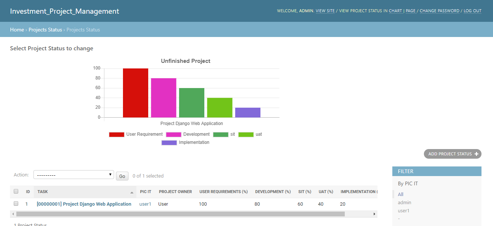

Django Coleman
==============

Django Coleman: A very simple Task Management web app written
with **Django Admin**.

* I modified this project to help the needs in the office.
* This project runs on Windows

Requirements
------------

* Python 3.5+ (tested with Python 3.6).
* Django 2.2 and other dependencies declared
  in the ``requirements.txt`` file (use virtual environments!).
* A Django compatible database like PostgreSQL or MySQL (by default uses
  the Python's built-in SQLite database for development purpose).
* Wamp Server (For MySQL and Apache Use)

Install and Run
---------------

*(Optional)* Create a virtual environment and activate it 

Install dependencies with::

    $ pip install -r requirements.txt

Create the database with::

    $ python3 manage.py makemigrations
    $ python3 manage.py makemigrations mtasks
    $ python3 manage.py makemigrations partner
    $ python3 manage.py migrate

To create an admin user::

    $ python3 manage.py createsuperuser

Then run in development mode with::

    $ python3 manage.py runserver

Access the application
----------------------

Like any Django app developed with Django Admin, enter with: http://localhost:8000/admin

Some screenshots
----------------

About
-----

**Original Project**: https://github.com/mrsarm/django-coleman

**Authors**: (2017-2019) Mariano Ruiz <mrsarm@gmail.com>

**License**: AGPL-v3
